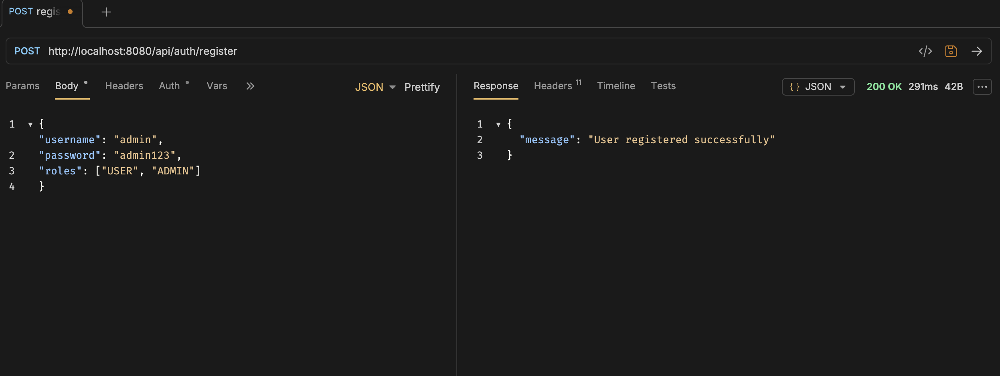
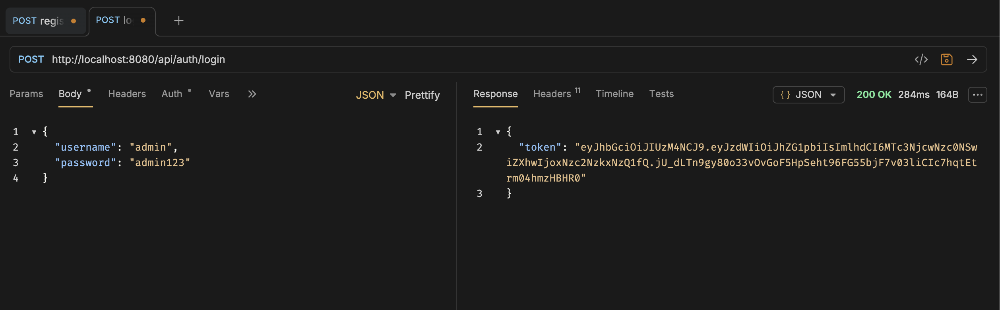
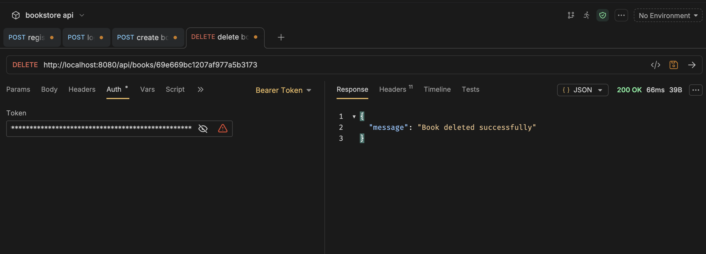
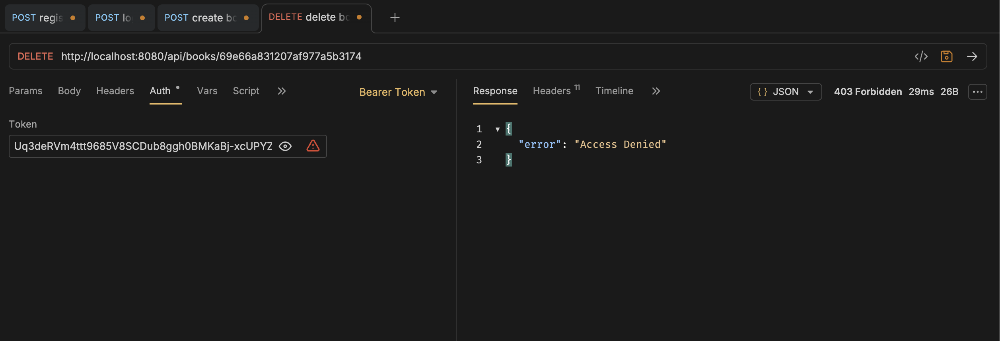

# Assignment 2 — JWT Role-Based Authorization

Extends the Bookstore API with ADMIN-only `DELETE /api/books/{id}` using Spring Security JWT role-based authorization.

## Changes Made

- **BookService.java** — added `deleteBook(id)` with 404 if book not found
- **BookController.java** — added `DELETE /api/books/{id}` returning 200 or 404
- **SecurityConfig.java** — restricted DELETE to `ADMIN` role; added `AccessDeniedHandler` returning `{"error": "Access Denied"}` on 403

## Postman / Bruno Screenshots

### 1. Register ADMIN user — 200 OK

### 2. Login as ADMIN — token visible in response

### 3. DELETE as ADMIN — 200 OK

### 4. DELETE as USER — 403 Forbidden

